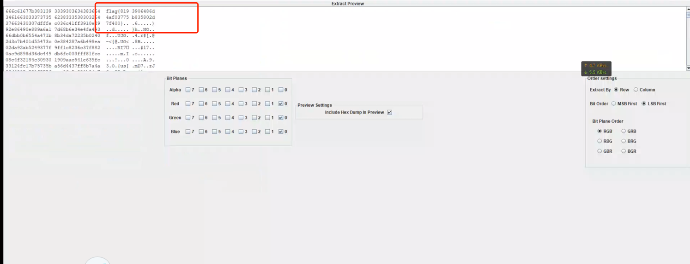

### 图片隐写-003

> lsb隐写

使用工具[Stegsolve.jar](http://www.caesum.com/handbook/Stegsolve.jar) 解密



也可使用python脚本

```python3
#!/usr/bin/env python3
# -*- coding: utf-8 -*-

from PIL import Image


def decode_lsb(image_path):
    """Decode message from image using LSB."""
    img = Image.open(image_path)
    width, height = img.size
    binary_message = ''

    for y in range(height):
        for x in range(width):
            pixel = img.getpixel((x, y))
            for value in pixel:
                binary_message += str(value & 1)

    # Find the end of message marker
    end_index = binary_message.find('1111111111111110')
    message = binary_to_string(binary_message[:end_index])

    return message


def binary_to_string(binary_str):
    """Convert binary string to text."""
    return ''.join(chr(int(binary_str[i:i + 8], 2)) for i in range(0, len(binary_str), 8))


# Example usage
image_path = "123.png"


# Decode message from image
decoded_message = decode_lsb("ctf.png")
print("Decoded message:", decoded_message)

```