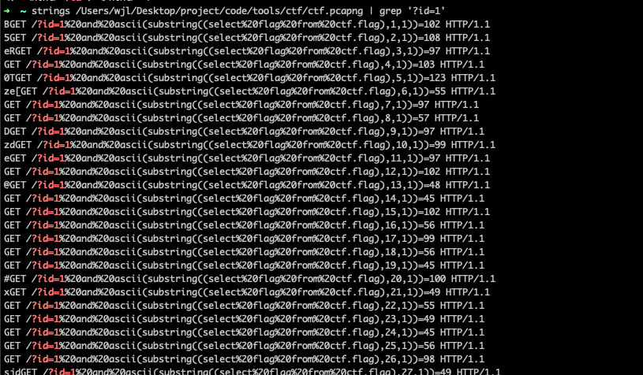

### 流量隐写-001
> sql注入-流量隐写

利用 `strings` 命令可直接提取HTTP请求中的内容




或者利用python 直接可提取

```python
import re

import pyshark
from urllib.parse import unquote

filter_expr = "http && http.request.full_uri"
cap = pyshark.FileCapture('sqli.pcapng', display_filter=filter_expr)
# 遍历数据包并打印摘要信息
requests_uris = []

for packet in cap:
    request_uri = packet.http.request_uri
    # url解码
    request_uri = unquote(request_uri)
    if 'ascii(substring' in request_uri:
        requests_uris.append(request_uri)
cap.close()
nums = {}
print(requests_uris)
flag = ""
for u in requests_uris:
    f_ord = re.findall(r',1\)\)=(.*)', u)[0]
    flag += chr(int(f_ord))
print(flag)

```

```text
flag{7a9acaf0-f8c8-d171-8b13-6f72ec91a21e}
```