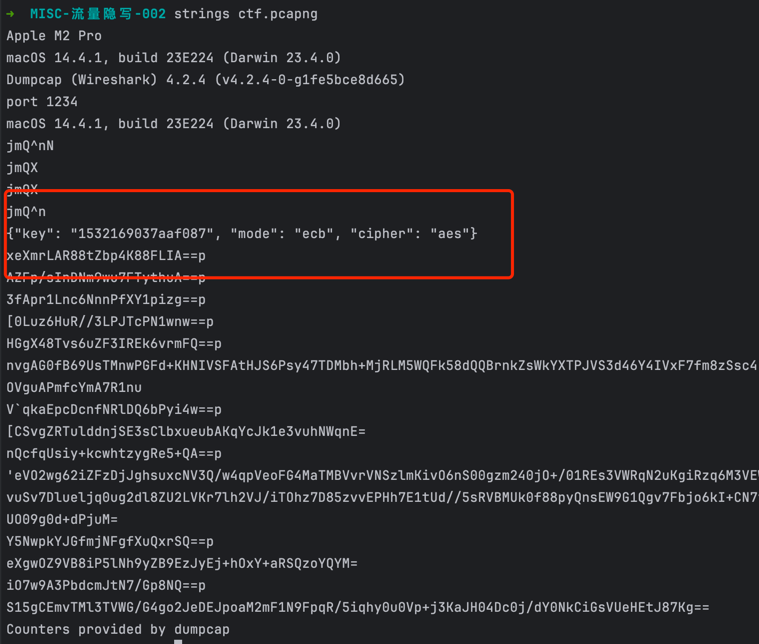
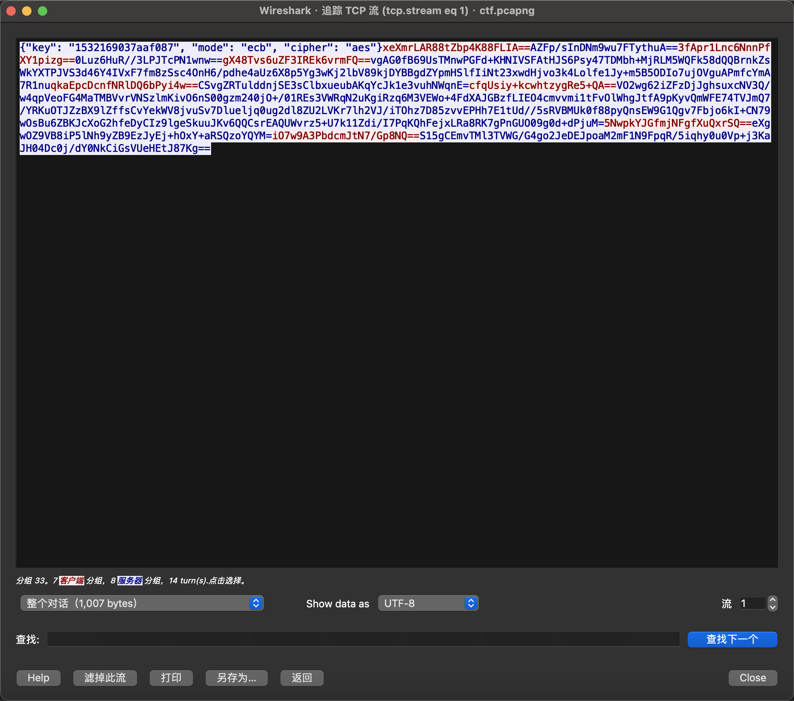
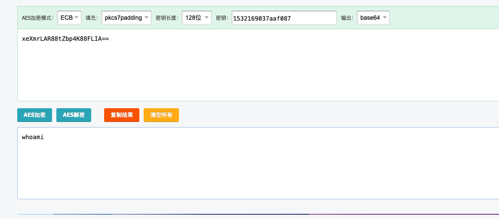
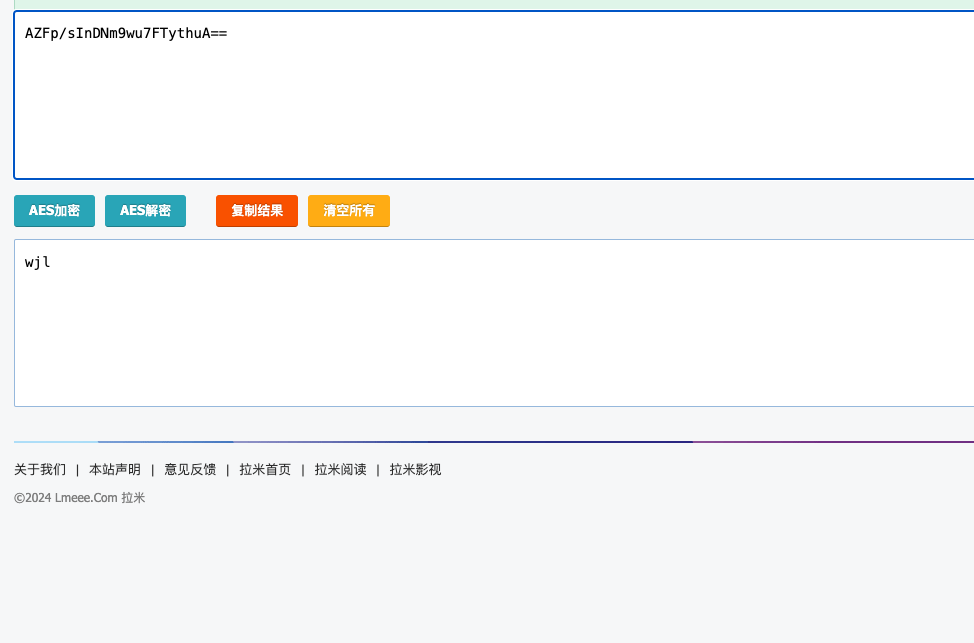
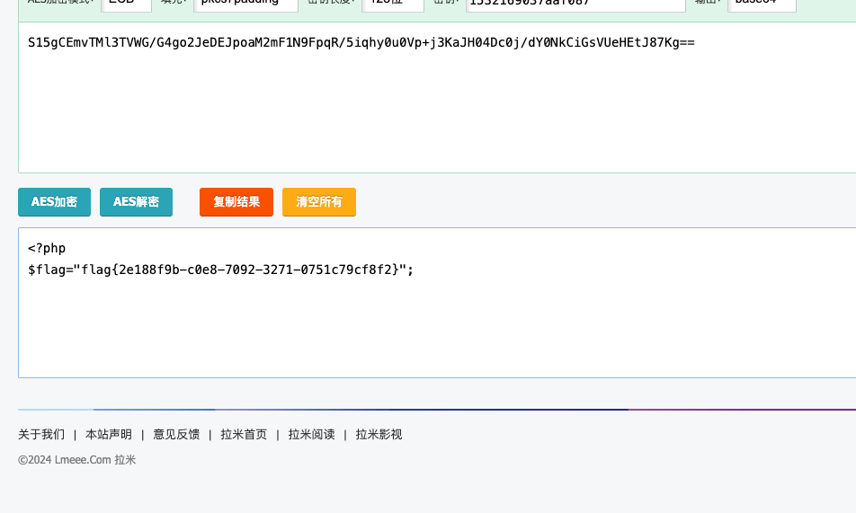

### 流量隐写-002
> sql注入-流量隐写

利用 `strings` 命令可直接提取wireshark中的strings，发现疑似`rsa`加密



使用wireshark查看后发现，果然为`aes`加密通讯



可使用在线工具进行解密[AES](https://tool.lmeee.com/jiami/aes)







也可使用`python`脚本

```python
import base64
import json
import re

import pyshark
from urllib.parse import unquote

from Crypto.Cipher import AES
from Crypto.Util.Padding import pad, unpad


# 加密函数
def encrypt(key, message):
    cipher = AES.new(key, AES.MODE_ECB)
    padded_plaintext = pad(message, AES.block_size)
    return base64.b64encode(cipher.encrypt(padded_plaintext)).decode("utf-8")


def decrypt(key, encrypted_message):
    cipher = AES.new(key, AES.MODE_ECB)
    text = cipher.decrypt(base64.b64decode(encrypted_message))
    return unpad(text, AES.block_size).decode("utf-8")
filter_expr = "tcp"
cap = pyshark.FileCapture('ctf.pcapng', display_filter=filter_expr)
# 遍历数据包并打印摘要信息
payloads = []
for pkt in cap:
    # 检查数据包是否为 TCP 协议
    if 'TCP' in pkt:
        # 访问 TCP 层信息
        tcp_layer = pkt['TCP']
        # 打印 TCP 载荷（数据）
        if hasattr(tcp_layer, 'payload') and tcp_layer.payload is not None:
            # 打印 TCP 载荷（数据）
            payload = bytes.fromhex(tcp_layer.payload.replace(":", ""))
            payloads.append(payload)

info_key = json.loads(payloads[0])['key']
print(info_key)
for i in range(1,len(payloads)):
    print(decrypt(info_key.encode("utf-8"),payloads[i].decode("utf-8")))
    


```

