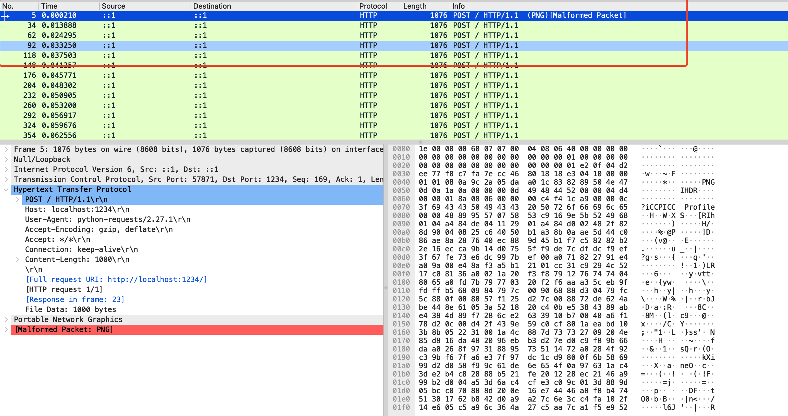
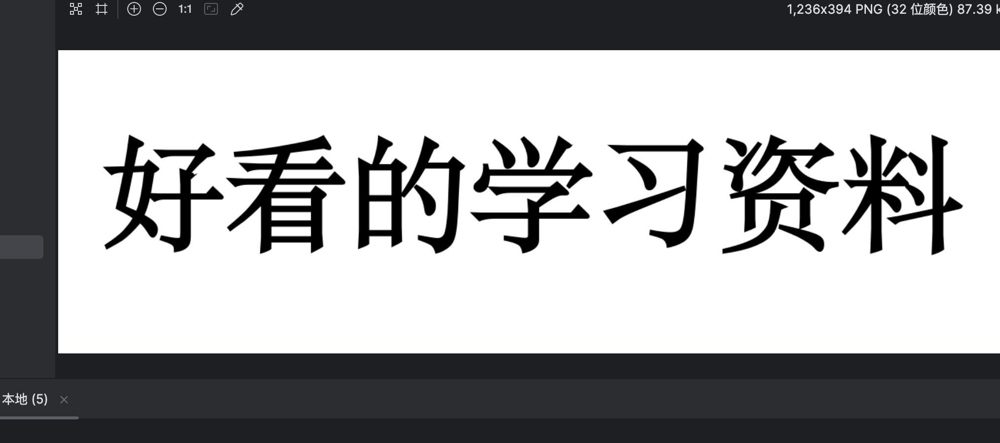
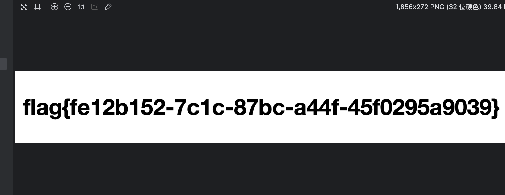

### 流量隐写-004

> 流量里提取图片

打开流量包发现大量请求，疑似png图片分步请求。



编写python脚本

```python
import pyshark
from pyshark.packet.layers.xml_layer import XmlLayer

filter_expr = "http && http.request.full_uri"
cap = pyshark.FileCapture('ctf.pcapng', display_filter=filter_expr)
# 遍历数据包并打印摘要信息
datas = []

for packet in cap:
    data: XmlLayer = packet.http
    datas.append(packet.http.file_data)
cap.close()
nums = {}
data_ = "".join(datas)
data_ = data_.replace(":", "")
byte_data = bytes.fromhex(data_)
open("test.png", "wb").write(byte_data)

```

得到test.png，打开得到图片



尝试使用`formost`分离图片，发现其中存在一个zip文件。打开解压即可发现flag

