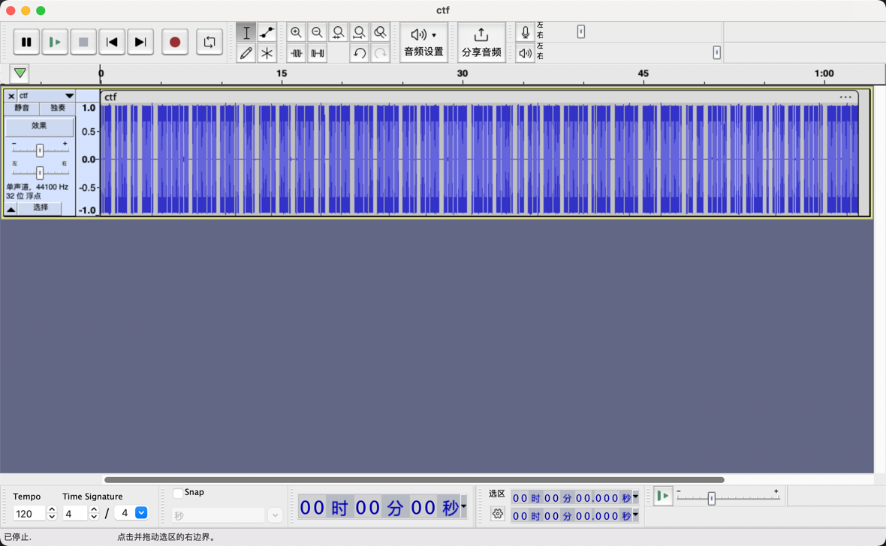

### 音频隐写-001
> 音频隐写 摩丝密码

打开ctf.mp3 后发现酷似摩丝密码，于是使用`audacity` 依据音频写出摩丝密码




```text
..-./.-../.-/--./----.--/-----/---../...../...--/..-./..---/.-/.----/---../.----/-.-./..---/-----/.----/--.../.-/..-./--.../-----/..---/-----/-.-./----./.-/.-/---../-.../...--/./...../-.../---../-----.-
```

解码后
```text
FLAG%u7b0853F2A181C2017AF7020C9AA8B3E5B8%u7d
```
%u7b、%u7d 是 `{`,`}`


